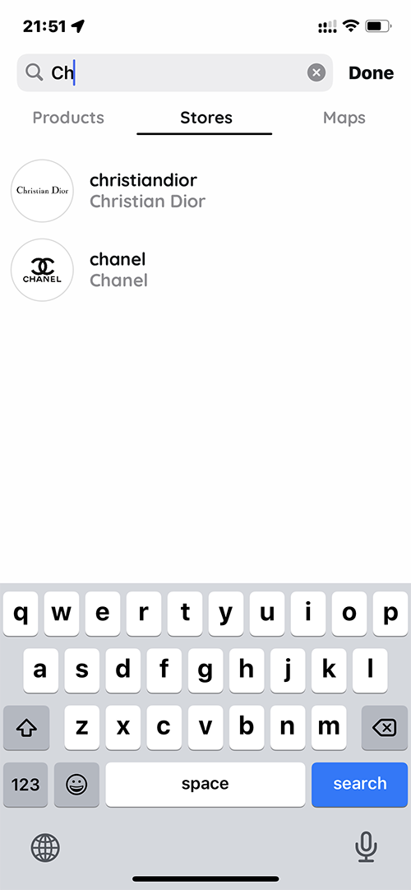

# Randevoo | Online Reservation Platform

### Senior Project II | Assumption University of Thailand

### [Project Proposal PDF](https://github.com/lexiddie/randevoo/blob/main/Randevoo%20Proposal.pdf)

### [Project Final Defense PDF](https://github.com/lexiddie/randevoo/blob/main/Randevoo%20Final%20Defense.pdf)

### [Project Report PDF](https://github.com/lexiddie/randevoo/blob/main/Randevoo%20Report.pdf)

## What is Randevoo?

Randevoo is an online reservation platform for local stores. It connects customers and stores with personalized reservations. Randevoo offers customers with comprehensive products specifications, store locations and helps arrange reservations via mobile application ✍🏿📱.

## Our story

The pandemic is nuts, and you cannot shop nor explore services out there. Most people wanted to be in a place with fewer people and safe enough to be serviced by shops, stores, restaurants, and other businesses. We want to create a platform that facilitates services as timeslots between customers and stores or shops to conduct business together in a timely manner. With that said, customers do not need to wait in line or queue to be serviced or served. As a result, the platform provides convenience, efficiency, and an exclusive experience to customers 🚀.

## Why does Randevoo exist?

### The problems are

1. Price: This is the essential concern for every customer buying online products or services💰.
2. Precision: This is another factor that most customers desire as their expectation🎲.
3. No easy way exists: To reserve reservations with multiple stores via a single service🗿.

## What benefits do we convey to end-users?

### The benefits are

1. Save money when exploring and comparing products from different stores for similar or identical products. And, when it comes to high-end and luxury products, some prominent's product price tags are significantly different. 🧧
2. Save time as soon as customers have found the desired product in a specific store. They can instantly book a reservation with the store. After their reservation is approved, the product virtually reserved belongs to the customers in the specific timeslot. ⏱
3. Experience exclusivity with the reservation. Once the store has approved a reservation, the customers virtually own the product for the allocated timeslot. Note that the exclusivity must be honored whether they buy or not. 🔬

## What can customers do?

1. Explore & Browse Products 🚀
2. View Reservations' Schedules 😼
3. Chat with Stores ✋
4. Reserve Reservations' Schedule 📱
5. Save Products 💛 List
6. Discover Stores' Locations [Google-Maps] 📍

## What can business owners do?

1. List Products 🧧
2. Setup Time-slot Schedules 😬
3. Chat with Customers 🖐🏿
4. View Customers' Profile 💂🏿‍♀️
5. Setup Account Information, Address, About, Map, and Policy 💬
6. Explore & Browse Products 🚀

## What is the marketing strategy?

The marketing strategy focuses on the exclusivity of the platform and creating a prestigious image for the platform with the right business partners within the environment. And every business partner has to be reviewed before approving to conduct business on the platform. The typical characteristics of the business partners are the ones with apparent standards, for instance, luxury fashion stores, fine dining, elegant beauty salon, luxury spa, business consultant, high-end auto body shops, and exotic auto dealerships, etc. This type of environment requires uniqueness and prestige class of business style as high-end and luxury class. The target customer segment includes those who prefer privilege, class, and sophisticated services. The main goal is not only to connect customers and stores but also to the brand name. As mentioned above, each customer can be invited by stores to be a club member. And a customer's profile will indicate what clubs that a customer belongs to.

Moreover, it's not just comprehending a customer's connection with stores; it provides trustworthy background checks to other stores during reservation requests. It will enhance more approval rate every time a customer makes a new reservation with new stores. As shown above, the customers are not just leveraging the platform service; they are also building their profiles by connecting with their very prestigious stores as they are being nominated as members 🤝.

## What are the experiences?

Seamless customer experience; Efficiently, Connecting the physical and digital shopping experience is very important to create a seamless environment for the customers. At the same time, the "Phygital" consumer experience is evolving. Randevoo is providing a holistic approach to customer service is the way of the future 🌚.
Is it available to download on mobile?
Currently, we only have iOS and web apps. And iOS is 90% finished; it launched in TestFlight on Feb 22, 2021. Moreover, the web app will be available to the admin to operate and manage the platform exclusively. However, we have planned to launch a web platform for users after we launched Android🚀💂🏿‍♀️.

## Technology Stack and Tools

- iOS (Swift)
- Snapkit (Autolayout)
- HorizonCalendar (AirBnB)
- MessageKit
- Algolia API
- React
- Redux (Saga, Persist, Reselect)
- JavaScript
- Google Cloud Platform
- GoogleMaps
- Cloud Firestore
- Cloud Functions
- Cloud Storage
- Cloud Messaging
- Sass
- Bootstrap
- Material UI
- Node.js

## System Diagram

## Algolia with Cloud Functions Diagram

## Notifications Diagram

## Platform

- **Randevoo iOS**: is written in Swift with an MVC design pattern, enhanced with Snapkit to handle all layouts without using storyboards. As a result, the app UI is fully rendered by pure Swift UIKit components.
- **Randevoo App**: is written in JavaScript ES6 using ReactJS for Client-Side Applications for Admin to review products, users, and stores.
- **Randevoo Cloud**: is written in TypeScript using NodeJS 12 as the Cloud Functions to be a middleware API to handle iOS notifications, Algolia's search indexing, and dispatching banned accounts.

## Announcement

The decision has been made, which we have moved on from this project. The business feasibility of this specific type of service does not provide a possibility in business ends. Since then, the Randevoo project will not be received any update on iOS or the Android platform.

We might be doing similar services like this in the future, and we will name it differently. Moreover, it is quite a journey for us to work, explore, be diverse, experience, and learn from real-world scenarios and business. Peace ✌🏿🙌🏿.

## Members and Roles

1. **SOKVATHARA LIN**: iOS Engineer | Full Stack Developer
2. **MENH KEO**: iOS Engineer

## Licenses

Content is released under the consent of the member who developed this very system. Any individual is allowed to use this project freely due to it has been open-sourced.

# Web Screenshot

 

# iOS Screenshot

